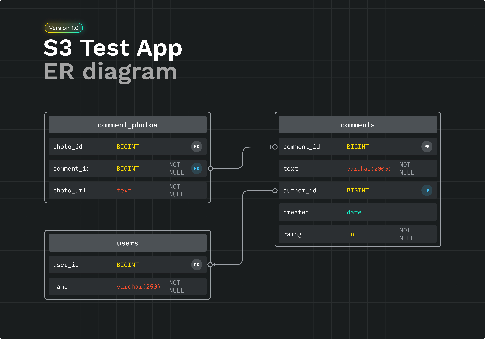

# Загрузка фотографий в S3

Тестовый проект, реализующий логику добавления пользователями отзывов к сущностям с возможностью прикрепить фотографии. Добавленный отзыв возвращается с ссылками на загруженные фотографии.

Приложение имеет микросервисную архитектуру с отдельным сервисом для загрузки фотографий. Фотографии сохраняются на облачное хранилище **S3 Yandex Object Storage**, используя **AWS SDK**.

Проект реализовывался на основе идеи из моего веб-приложения [Explore With Me.](https://github.com/NikitaBuffy/java-explore-with-me)


## Используемые технологии

**Клиент:** RestTemplate

**Сервер:** Java 11, Spring Boot, Maven, Hibernate, PostgreSQL, Lombok, Docker, [AWS SDK](https://aws.amazon.com/ru/sdk-for-java/), Java Concurrency


## Инструкция по запуску

Для развертывания приложения:

- Склонируйте репозиторий на локальный компьютер
- В docker-compose.yml укажите [ваши данные для доступа к Yandex Object Storage](https://cloud.yandex.ru/docs/iam/operations/sa/create-access-key) в переменных окружения `BUCKET_NAME`, `ACCESS_KEY_ID`, `SECRET_KEY`
- Соберите проект:

```bash
  mvn clean package
```
```bash
  docker compose up
```


## Фичи

- Хранение и доступ к фотографиям из S3 с использованием AWS SDK
- Загрузка каждой фотографии в отдельном потоке для увеличения производительности


## Спецификация API

Ниже описаны основные запросы для проверки реализации проекта.

### Основной сервис

#### Создание пользователя

```http
Header: application/json
POST /users
```

| Параметр | Тип     | Описание                |
| :-------- | :------- | :------------------------- |
| `name` | `String` | Данные добавляемого пользователя|

Пример тела запроса:
```json
{
  "name": "Nick"
}
```

#### Создание отзыва/комментария

```http
Header: multipart/form-data
POST /comments/users/{userId}
```

| Параметр | Тип     | Описание                       |
| :-------- | :------- | :-------------------------------- |
| `userId`      | `Long` | ID пользователя |
| `text`      | `String` | **Required.** Текст отзыва (от 50 до 2000 символов) |
| `rating`      | `int` | **Required.** Рейтинг, поставленный в отзыве (от 1 до 5) |
| `photos`      | `List<MultipartFile>` | Фотографии, прикрепленные к отзыву |

Пример тела успешного ответа при добавлении отзыва с фотографиями:
```json
{
    "id": 9,
    "authorName": "Nick",
    "text": "Отличное заведение. Мне все понравилось, обязательно приду еще раз и покушаю булочек.",
    "created": "2023-09-19 15:43:48",
    "rating": 5,
    "photos": [
        "https://your-bucket.storage.yandexcloud.net/your-file-name",
        "https://your-bucket.storage.yandexcloud.net/your-file-name",
        "https://your-bucket.storage.yandexcloud.net/your-file-name",
    ]
}
```

### Upload сервис

Эндпоинт используется только для внутренних запросов от основного сервиса через Upload Client.

#### Загрузка фотографий

```http
Header: application/json
POST /upload
```

| Параметр | Тип     | Описание                |
| :-------- | :------- | :------------------------- |
| `photos` | `List<byte[]>` | Список фотографий в байтах|

## База данных

Полученные ссылки на фотографии сохраняются в БД, прикрепляясь к отзыву. При отправке GET запроса на получение отзыва или списка всех отзывов, ссылки подтягиваются прямо из БД без обращения в облако. 



## Планы по доработке

- Реализовать функционал удаления фотографий из S3 при удалении отзыва

